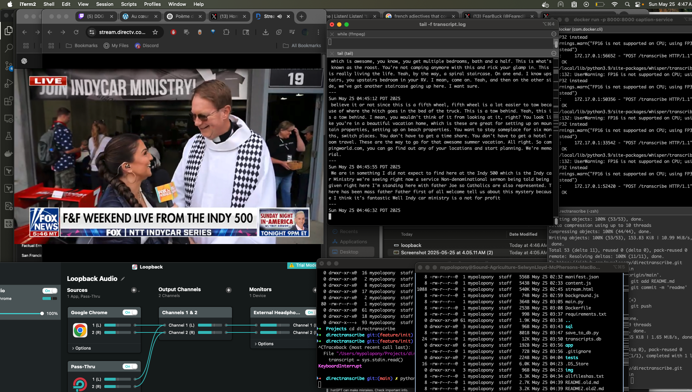

# 📡 Directranscribe

**Directranscribe** is a real-time transcription pipeline that captures audio from a Chrome browser tab, transcribes it using OpenAI’s Whisper model, and stores the results in a local SQLite database for later retrieval and analysis. It’s ideal for transcribing streamed content like webinars, meetings, or live TV.

---

## 🔧 Features

- 🎤 **Live Audio Capture** from Chrome tabs (via macOS Loopback + `ffmpeg`)
- 🧠 **Real-Time Transcription** using Whisper via a FastAPI backend
- 💾 **Local Persistence** with SQLite for searchable transcripts
- 🧩 **Chrome Extension** for quick control and integration
- 🔦 **Terminal log preview** via `transcript.log`
- 🐳 **Dockerized** for easy setup and reproducibility

---

## 🏗️ Project Structure

```
directranscribe/
├── app/                   # FastAPI transcription backend
├── sql/                   # SQLite setup and schema
├── img/                   # App icons and static assets
├── main.py                # Launcher for the full pipeline
├── save_to_db.py          # Handles saving transcription chunks
├── background.js          # Chrome extension background script
├── content.js             # Chrome extension tab content script
├── manifest.json          # Chrome extension metadata
├── stream.html            # Extension interface (popup or tab)
├── requirements.txt       # Python dependencies
├── Dockerfile             # Containerized setup
└── README.md              # You’re here!
```

---

## 🚀 Quickstart

### 1. 🐳 Build & Run with Docker

```bash
docker build -t directranscribe .
docker run -p 8000:8000 directranscribe
```

### 2. 🔊 Set Up Loopback Audio (macOS)

To capture browser audio:

- Use [Loopback](https://rogueamoeba.com/loopback/) to create a virtual device that includes Chrome output.
- Set Chrome’s output to this virtual device.
- Confirm with `ffmpeg` that you’re capturing correctly.

### 3. 🧩 Install Chrome Extension

- Load `manifest.json` as an **unpacked extension** in Chrome:
  - Visit `chrome://extensions/`
  - Enable **Developer Mode**
  - Click **"Load unpacked"** and select the project root

### 4. ▶️ Start Transcribing

- Launch the FastAPI backend (`main.py`)
- Use the extension to start capturing
- Transcriptions will be displayed and saved to SQLite automatically

---

## 🧪 Development

### Run Locally (no Docker)

```bash
poetry install  # or `pip install -r requirements.txt`
uvicorn app.main:app --reload
```

---

## 🛠️ Advanced CLI Usage

Record from Chrome → transcribe → log every 30 seconds:

```bash
while true; do
  echo "$(date)" >> transcript.log
  ffmpeg -f avfoundation -i ":4" -ac 1 -ar 16000 -t 30 -filter:a "volume=10dB" -y chunk.wav -loglevel quiet
  curl -s -X POST http://localhost:8000/transcribe -F "file=@chunk.wav"     | tee -a transcript.log     | jq -r .transcript     | python3 save_to_db.py "DirectTV"
  echo "---" >> transcript.log
done
```

---

## 💾 Database Schema

Initialize with:

```bash
sqlite3 transcripts.db < sql/0_init.sql
```

Example schema:

```sql
CREATE TABLE transcripts (
  id INTEGER PRIMARY KEY AUTOINCREMENT,
  timestamp DATETIME DEFAULT CURRENT_TIMESTAMP,
  label TEXT,
  transcript TEXT
);
```

Query with:

```bash
sqlite3 transcripts.db "SELECT timestamp, label, transcript FROM transcripts ORDER BY id DESC LIMIT 10;"
```

---

## 🧠 Future Ideas

- 🔍 **Searchable Web UI** for stored transcripts
- 📤 Export transcripts as `.txt` or `.srt`
- 🌍 OS-agnostic audio capture setup
- 🔐 Authentication for hosted deployments
- 🏷️ Auto-tagging and show detection
- 🤖 Full-text search or LLM summarization

---

## 📸 Examples



---

## Example Text

```
Sun May 25 04:53:34 PDT 2025
 We all work so hard. It's so funny how, like, the racing 
 world and dairy farmers have so much in common. I mean, 
 I feel like we have a pit crew that helps run our farm. I
 mean, it takes a bunch of people just like an Indie car 
 driver does. You know, we're the fourth generation raising 
 the fifth generation. I have two daughters. So to be, this 
 is only the second time two women have been milk presenters
 at the Indianapolis 500. So to be a role model and help 
 inspire our children. We're hoping for that and we're a 
 robot dairy. So we have robots at milk our cows. So we're
 our cow, now.
```

## 🙏 Credits

- [OpenAI Whisper](https://github.com/openai/whisper)
- [Loopback Audio](https://rogueamoeba.com/loopback/)
- [FastAPI](https://fastapi.tiangolo.com/)
- [ffmpeg](https://ffmpeg.org/)