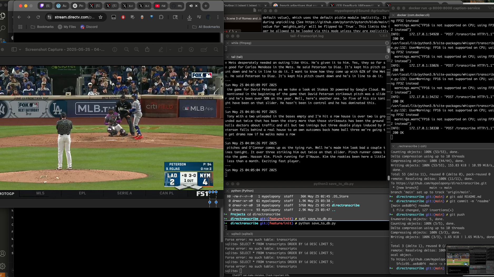

# directranscribe

[100% autogenerated, but not wrong]

**Live audio transcription from DirectTV stream** using Loopback Audio, Whisper, and a fast SQLite logging backend.

This repo captures streaming audio from Chrome tabs (e.g. [stream.directv.com](https://stream.directv.com)), transcribes it using OpenAI’s Whisper, and stores the results in a local database for future analysis.

---

## Features

* 🧠 Real-time transcription with OpenAI Whisper (via FastAPI)
* 🔊 Audio capture using macOS Loopback Audio and `ffmpeg`
* 📝 Persistent storage using SQLite with labels and timestamps
* 🔦 Terminal log preview via `transcript.log`
* ⚙️ Dockerized backend for easy deployment

---

## Requirements

* macOS (tested on Apple Silicon)
* [Loopback Audio](https://rogueamoeba.com/loopback/) (or similar virtual audio router)
* Docker
* Python 3.9+
* ffmpeg
* jq (optional, for clean terminal output)

---

## 🚀 Setup

### 1. Clone and install dependencies

```bash
git clone https://github.com/mypolopony/directranscribe.git
cd directranscribe
pip install -r requirements.txt
```

### 2. Build and run the transcription API

```bash
docker build -t caption-service .
docker run -p 8000:8000 caption-service
```

Visit: [http://localhost:8000/docs](http://localhost:8000/docs) to test the FastAPI endpoint.

---

## Live Audio Loop

Record from Chrome → transcribe → log every 30 seconds:

```bash
while true; do
  echo "$(date)" >> transcript.log
  ffmpeg -f avfoundation -i ":4" -ac 1 -ar 16000 -t 30 -filter:a "volume=10dB" -y chunk.wav -loglevel quiet
  curl -s -X POST http://localhost:8000/transcribe -F "file=@chunk.wav" \
    | tee -a transcript.log \
    | jq -r .transcript \
    | python3 save_to_db.py "DirectTV"
  echo "---" >> transcript.log
done
```

---

## 💃️ Database

Initialize with:

```bash
sqlite3 transcripts.db < sql/0_init.sql
```

Example schema:

```sql
CREATE TABLE transcripts (
  id INTEGER PRIMARY KEY AUTOINCREMENT,
  timestamp DATETIME DEFAULT CURRENT_TIMESTAMP,
  label TEXT,
  transcript TEXT
);
```

Query with:

```bash
sqlite3 transcripts.db "SELECT timestamp, label, transcript FROM transcripts ORDER BY id DESC LIMIT 10;"
```

---

## 📂 Project Structure

```
app/               # FastAPI server with Whisper backend
save_to_db.py      # Logs transcripts into SQLite
sql/               # Schema setup
requirements.txt   # Python deps
Dockerfile         # Containerized transcription API
README.md          # You are here
```

---

## ✅ To Do2

* [ ] Add subtitle (.srt) generation
* [ ] Streamlit dashboard for transcript browsing
* [ ] Auto-tagging and show detection
* [ ] Full-text search or LLM summarization

## Example


